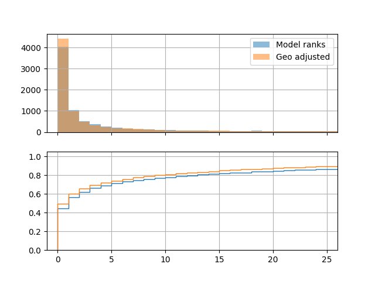

# chorus
Determine the bird from its call.

## Performance

(Performance data as of commit a2c8f1afa72e1e49528478c4067c093d4a981a80)

The current model uses a resnet-style architecture on the raw audio waveform (sampled at 30,000 Hz).

Across the 205 species with enough data, the model is able to pick out the correct species _exactly_ about 45% of the time. If given five attempts, the model can guess correctly about 75% of the time.

**NOTE:** This is on data that looks similar to the training data, specifically, most of the tested audio files were recorded with higher end equipment than your average smartphone.

Including geographic information (using ebird's range maps) to filter out species that were not in that are provides slight improvements over the pure audio model.



_This figure shows where the model ranked the correct species (with ranks along the x axis). The top plot is a histogram of the raw counts, and the bottom plot shows the cumulative percent covered. Orange indicates rankings that were adjusted according to the geographic data, with blue indicating ranks obtained purely from the audio model._


_This figure shows the ROC curves for all 205 species. It is useful to get a sense of overall performance in a one-vs-rest scenario._

## Resources

* Audio Databases
    * https://www.macaulaylibrary.org
        * Tons of recordings, but requires signup/license agreement.
    * https://avocet.integrativebiology.natsci.msu.edu
        * All recordings seem to be licensed under "Creative Commons Attribution-Noncommercial-Share Alike 3.0 United States License".
        * Files available in `.wav` format.
        * Small recording counts for most species.
    * https://www.xeno-canto.org
        * Full rest API offered.
        * Seems like most recordings are "only" MP3 files.
        * Recordings typically (always?) licensed under with one of the CC licenses.
        * Large number of recordings for most species.
* Species range maps
    * https://cornelllabofornithology.github.io/ebirdst/articles/ebirdst-introduction.html
        * High quality range maps of 600 species, with a large overlap of xeno-canto species.

After reviewing, it seems like xeno-canto is a clear winner in the short term. If the Macaulay Library is willing to share their data they might be a good follow up.

*Update:* After receiving the terms of use from Macaulay Library, it seems like they are too restrictive:

> Macaulay Library media and data may not be reproduced, distributed, **or used to make products of any kind (whether commercial or noncommercial)** without prior written permission of the Cornell Lab of Ornithology.
> ...
> All Macaulay Library media assets are provided with additional supporting metadata sufficient to make sensible and informed decisions about data use.

(Emphasis mine.) I'll just stick with xeno-canto.

## Developing

### Python dependencies

This code requires python >= 3.9.

This project uses `pip-tools` to track requirements. It's recommended, but not required, to run the code.

```bash
# Bare minimum for running the code.
pip-sync requirements.txt
# alternatively, pip install -r requirements.txt

# To get packages needed for development / data downloading as well:
pip-sync dev-requirements.txt
```

If you want to try and be looser with the package versions, you can just reference the corresponding `.in` file.

### ffmpeg

You must install `ffmpeg` for the audio loading.

### gdal

In order to process the species range maps, we use the `rasterio` package. You [need to install gdal](https://rasterio.readthedocs.io/en/latest/installation.html#linux) before installing `rasterio`.:

```bash
sudo apt-get install gdal-bin libgdal-dev
```

### llvm

You may not have a compatible version of `llvm` installed. I worked around this as follows:

```bash
sudo apt-get install "llvm-10*"  # latest compatible release
# Use llvm 10 while installing packages
LLVM_CONFIG=llvm-config-10 pip-sync dev-requirements.txt
```

### Getting the data

Use the command line interface. ***You'll need about 400 GB of free space and 48 hours.***

```bash
######### For Audio
# First get the meta data (about 200MB)
python cli.py data xc-meta --help

# Next download the audio (about 60GB, ~24 hours)
python cli.py data xc-audio --help

# Finally, convert audio to numpy format (about 320GB, ~24 hours)
# This format takes up more space, but loads 800 times faster.
python cli.py data xc-to-npy --help

######### For Range maps
# First get the meta data (about 100KB)
python cli.py data range-meta --help

# Then download and process the range maps (about 3GB)
# Range maps are processed in memory and the full res versions
# are never persisted to save on space.
python cli.py data range-map --help

######### For background (ambient) noise to augment (200MB)
python cli.py data background
```
